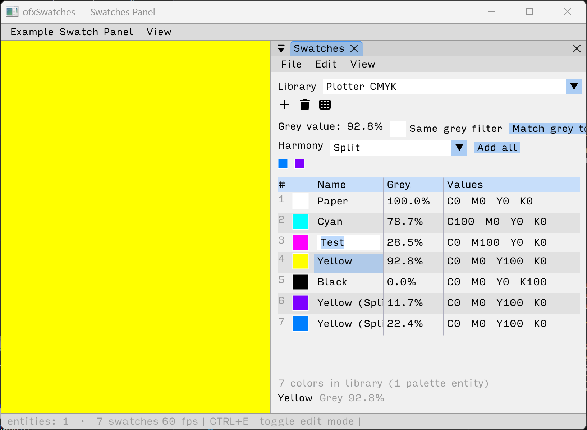

# ofxSwatches



Color swatch libraries for openFrameworks with CMYK support, grey value (perceived luminosity %), color harmonies, JSON persistence, and an ImGui `SwatchesPanel`.

## Features

- **SwatchColor** — RGB, CMYK (0–100), and HSB construction; spot-color flag
- **Color harmonies** — Complementary, Triadic, Tetradic, Analogous, Split-Complementary, Monochromatic
- **Grey value** — WCAG relative luminance 0–100 %; neutral-grey detection; `toGreyEquivalent()`
- **Contrast** — WCAG contrast ratio; `meetsContrastAA` / `meetsContrastAAA` helpers
- **SwatchLibrary** — named palettes; add/remove/reorder; harmony generation
- **JSON persistence** — `saveLibrary` / `loadLibrary`, format v2 with full CMYK round-trip
- **SwatchesPanel** — Layers-style ImGui panel (requires ofxImGuiStyle)
- **ECS** — `ecs::swatch_library_component` extends `SwatchLibrary` via ofxEnTTKit

## Dependencies

- Core: openFrameworks
- Panel: ofxImGui, ofxImGuiStyle, ofxEnTT (entity ids in panel callbacks)
- Kit apps: ofxEnTTKit, ofxKit

## Quick start

```cpp
#include "ofxSwatches.h"

ofxSwatches::SwatchLibrary library("My Palette");

// Add colours
library.addCMYK(100, 0, 0, 0, "Cyan");
library.addCMYK(0, 100, 0, 0, "Magenta");
library.addColor(ofColor(255, 87, 34), "Deep Orange");
library.addColor(ofxSwatches::SwatchColor::fromHSB(191, 180, 200, "Violet")); // 0–255 hue

// Save to bin/data/My Palette.json
ofxSwatches::saveLibrary(library);

// Load from bin/data/My Palette.json
ofxSwatches::loadLibrary(library);

// Or supply an explicit path
ofxSwatches::saveLibrary(library, "/path/to/palette.json");
ofxSwatches::loadLibrary(library, "/path/to/palette.json");
```

## SwatchColor API

```cpp
// Construction
SwatchColor c = SwatchColor::fromCMYK(0, 100, 0, 0, "Magenta");
SwatchColor d = SwatchColor::fromHSB(128, 200, 220, "Teal"); // OF 0–255 range
SwatchColor e(ofColor(255, 87, 34), "Deep Orange");

// Properties
c.getDisplayName();       // "Magenta" — or "C0 M100 Y0 K0" if unnamed
c.getCMYK();              // glm::vec4 (0–100 each)
c.getGreyValuePercent();  // WCAG relative luminance 0–100 %
c.getGreyValueSimple();   // Fast perceived grey 0–100 %
c.isNeutralGrey();        // true when R ≈ G ≈ B
c.toGreyEquivalent();     // desaturated ofColor at same luminance

// Contrast
float ratio = ofxSwatches::contrastRatio(c.color, ofColor::white); // 1.0–21.0
bool ok = ofxSwatches::meetsContrastAA(ratio);

// Harmony (returns new SwatchColors, does not modify c)
SwatchColor comp = c.getComplementary();
auto triad      = c.getTriadic();           // std::vector<SwatchColor> (2)
auto mono       = c.getMonochromatic(5);    // 5 tints/shades
```

## SwatchLibrary API

```cpp
ofxSwatches::SwatchLibrary lib("My Library");

lib.addCMYK(0, 0, 0, 100, "Black");
lib.addColor(ofColor::red, "Red");
lib.count();                     // int
lib.getColor(0);                 // SwatchColor* (nullptr if out of range)
lib.getByName("Red");            // SwatchColor* (nullptr if not found)
lib.hasColor("Red");             // bool
lib.removeColor(0);              // by index
lib.removeColor("Red");          // by name
lib.reorderColor(0, 3);         // drag-reorder

// Append harmony colors derived from swatch at index
lib.generateHarmonyFrom(0, ofxSwatches::ColorHarmony::Triadic);

// Find swatches with similar luminance (±tolerance %)
std::vector<int> matches = lib.findSameGreyValue(50.0f, 2.0f);
```

## JSON format

```json
{
  "libName": "My Library",
  "version": 2,
  "richBlack": { "c": 60, "m": 40, "y": 40, "k": 100 },
  "Swatches": [
    { "name": "Cyan", "type": 1, "c": 100, "m": 0, "y": 0, "k": 0,
      "r": 0, "g": 255, "b": 255, "a": 255, "spot": false, "spotInk": "" }
  ]
}
```
